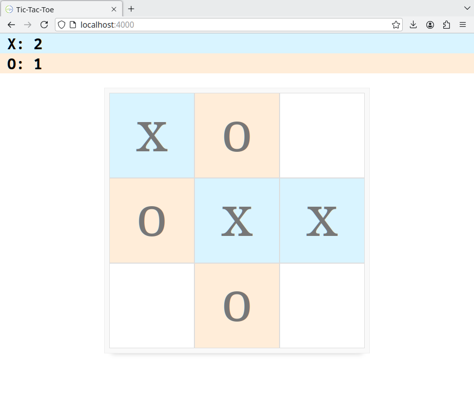

# Tic-tac-toe

Tic-tac-toe implementation made with ClojureScript, shadow-cljs and Reagent as part of a take-home exercise. 

## Usage

You can try it out here: https://mateodif.github.io/tictactoe/

To run this app, you'll need `npm` and `shadow-cljs` installed.
From your command line:

1. Clone this repository
2. Install dependencies with `npm install`
3. Start `shadow-cljs` using `shadow-cljs watch app` or `npx shadow-cljs watch app` (depending on your installation)
4. Enter `http://localhost:4000` from your browser

You can also run tests with `shadow-cljs watch test` and checking the output in `http://localhost:3001`.
